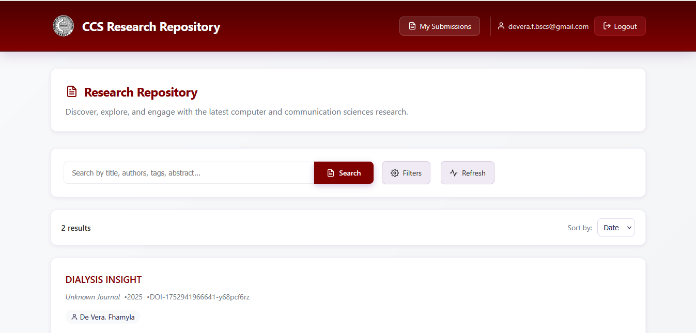

# CCS Research Repository

This is the github repo for the CCS Research Repository System. It provides RESTful APIs for user authentication, paper management, email notifications, and more.



## Setup Instructions

### Backend
```bash
cd backend
npm install
```

**Configure environment variables:**
   Create a `.env` file in the `backend/` directory with the following content:
   ```env
   MONGODB_URI=your_mongodb_connection_string
   GMAIL=your_gmail_address@gmail.com
   GMAIL_PASSWORD=your_gmail_app_password
   ```
   - For Gmail, use an [App Password](https://support.google.com/accounts/answer/185833) if you have 2FA enabled.

```bash
npm run dev
```

### Frontend
```bash
cd frontend
npm install
npm run dev
```

## Features
- User registration and authentication (with OTP email verification)
- Admin and moderator user management
- Paper request and approval system
- Email notifications using Gmail SMTP
- MongoDB database integration
- Intelligent file upload analysis:
  - Automatically detects and blocks duplicate files by analyzing file contents during upload.
  - Prevents uploading of empty files.
  - Analyzes uploaded files to ensure they are valid research papers, blocking files that do not meet the criteria.

## Prerequisites
- Node.js (v16 or higher recommended)
- npm
- MongoDB Atlas or local MongoDB instance

## API Endpoints
- User registration, login, and OTP: `/auth`
- Paper requests: `/paperRequests`
- Papers: `/papers`
- Admin user management: `/auth/admin/users`

## Environment Variables
| Variable         | Description                        |
|------------------|------------------------------------|
| MONGODB_URI      | MongoDB connection string          |
| GMAIL            | Gmail address for sending emails   |
| GMAIL_PASSWORD   | Gmail app password                 |

## Notes
- Make sure your `.env` file is correctly formatted and saved with UTF-8 encoding.
- For email features, Gmail may require you to enable 2FA and use an App Password.
- Restart the server after changing environment variables.

## License
MIT 
